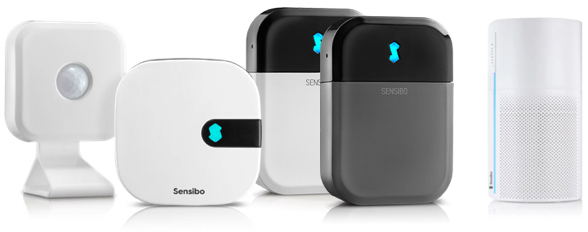

<h1 align="center">Homebridge Sensibo — Matter fork</h1>

<p align="center">
    
</p>

<p align="center">
    <a href="https://www.npmjs.com/package/homebridge">
        
    </a>
    <a href="https://sensibo.github.io/">
        
    </a>
    <a href="#climate-react-as-the-auto-mode">
        
    </a>
    <a href="LICENSE">
        
    </a>
</p>

---

[Homebridge](https://github.com/homebridge/homebridge) plugin for [Sensibo](https://sensibo.com/) - Smart AC Controller and Air Purifier

> **This is a fork of [nitaybz/homebridge-sensibo-ac](https://github.com/nitaybz/homebridge-sensibo-ac).**
> Everything that plugin does, this one does. Two things are added on top.
>
> **[Climate React as the AUTO mode](#climate-react-as-the-auto-mode)** — the HomeKit AUTO mode is backed by
> Climate React instead of the AC's native AUTO, so the unit (and its fan) actually switches off between
> cooling cycles rather than running on indefinitely. The AUTO temperature range sets the Climate React
> thresholds.
>
> **Matter**, alongside HomeKit rather than instead of it, so the same air conditioner and its humidity
> sensor reach Alexa, SmartThings and Aqara. Both halves drive the same accessory state, and a command
> carrying the value this plugin has just reported is ignored — that is a controller keeping its own
> attributes in step, not a person changing anything, and obeying it had the two ecosystems talking each
> to each other in circles.
>
> See [Changes in this fork](#changes-in-this-fork).



## Requirements


Check with: `node -v` & `homebridge -V` and update if needed

## Devices Supported

- **Sensibo Sky**
- **Sensibo Air** including additional **Room Sensors**
- **Sensibo Air Pro** (sometimes called Plus) including air quality, CO2 and additional **Room Sensors**
- **Sensibo Elements** including air quality, CO2 and PM2.5
- **Sensibo Pure** (Air Purifier) control, including fan speed and boost control

## Plugin Features

- Login with **username & password** or **API-key** visit [https://home.sensibo.com/me/api](https://home.sensibo.com/me/api) to get your unique API-key
- **Auto Detect Configurations** - Automatically detect your devices, their capabilities and add available control options to the Apple Home app (HomeKit)
- **HeaterCooler** (Air Conditioner) control, including adjusting fan speed (Rotation Speed) & vertical swing (Oscillate) from within the accessory in the Apple Home app.
- **AC Sync Button** - easily toggle the state of the AC between ON/OFF in case your AC is out of sync (does not send commands to the AC)
- **Climate React** - enable/disable Climate React (Smart mode). To adjust the settings, use the Sensibo app or turn on `Climate React Auto Setup`
- **Climate React as the AUTO mode** *(this fork)* - the HomeKit AUTO mode is driven by Climate React, so the AC switches fully off between cycles instead of running its fan continuously. The AUTO temperature range sets the Climate React thresholds
- **Occupancy Sensor** - show the Home/Away status from Sensibo in the Home app via Occupancy sensor
- **Matter** *(this fork)* - also publish your AC over Matter, so the same device can be paired with Aqara, Alice, SmartThings, Alexa and other ecosystems alongside Apple Home. Requires Homebridge v2
- **History Storage** - store temperature and humidity measurements over time, review them in the Eve app as a graph

Depending on your AC device and which remote code you've setup in the Sensibo app you may also have access to:

- **Dry Mode** (dehumidifer) control, including fan speed and (vertical) swing control
- **Fan Mode** control, including fan speed and (vertical) swing control
- **Horizontal Swing** - allows you to enable/disable horizontal swing
- **Filter Cleaning Indication** - show filter status in the Home app for your accessories. Can be reset in the Eve app

Depending on your Sensibo device, you may also have access to:

- **Air Quality Sensor** - Sensibo Air Pro, Sensibo Pure and Sensibo Elements devices only, see the current air quality, CO2 and PM2.5 (PM2.5 on Elements only)
- **Air Purifier** - Sensibo Pure only - control, including fan speed and boost control

## Installation

This plugin is Homebridge verified (and previously HOOBS certified) and can be easily installed and configured through their UI.

1. Install Homebridge, see [https://homebridge.io/how-to-install-homebridge](https://homebridge.io/how-to-install-homebridge)
2. Install this plugin, login to your Homebridge instance and navigate to Plugins
3. Search for homebridge-sensibo-ac
4. Click the down arrow icon to install
5. Once installed, restart Homebridge
6. To start using the plugin, click the three dots (menu) for this plugin on the Plugins page and then click `Plugin Config`, at a minimum provide your Sensibo API key or username and password.

See `config-sample.json` in this repository for an example.

### Manual install

If you don't use Homebridge UI or HOOBS keep reading...

On a device with Homebridge already installled:

1. Install this plugin (Note: this is global) using NPM from:
    - NPM: `sudo npm install -g homebridge-sensibo-ac`, or
    - GIT: `sudo npm install -g git+https://github.com/nitaybz/homebridge-sensibo-ac.git`
2. Update your configuration file manually. See `config-sample.json` in this repository for an example

## Configuration

### Easy config (required)

```json
"platforms": [
    {
        "platform": "SensiboAC",
        "username": "******@*******.***",
        "password": "******"
    }
]
```

### Advanced config (optional)

```json
"platforms": [
    {
        "platform": "SensiboAC",
        "apiKey": "***************",
        "allowRepeatedCommands": false,
        "carbonDioxideAlertThreshold": 1500,
        "climateReactSwitchInAccessory": false,
        "disableAirQuality": false,
        "disableCarbonDioxide": false,
        "disableDry": false,
        "disableFan": false,
        "disableHorizontalSwing": false,
        "disableHumidity": false,
        "disableLightSwitch": false,
        "disableVerticalSwing": false,
        "enableClimateReactAutoSetup": false,
        "enableClimateReactSwitch": true,
        "enableHistoryStorage": true,
        "enableOccupancySensor": true,
        "enableSyncButton": true,
        "externalHumiditySensor": false,
        "ignoreHomeKitDevices": false,
        "syncButtonInAccessory": false,
        "devicesToExclude": [],
        "locationsToInclude": [],
        "modesToExclude": [],
        "debug": false
    }
]
```

### Available settings

See below the table for additional details on these settings.

|          Parameter         |                       Description                                | Required |  Default |   type   |
| -------------------------- | ---------------------------------------------------------------- |:--------:|:--------:|:--------:|
| `platform`                 |  Always "SensiboAC"                                              |     ✓    | `SensiboAC` |  String  |
| `apiKey`                   |  Your Sensibo account API key (can be used instead of username/password)    |     ✓*   |     -    |  String  |
| `username`                 |  Your Sensibo account username/email                             |     ✓*   |     -    |  String  |
| `password`                 |  Your Sensibo account password                                   |     ✓*   |     -    |  String  |
| `allowRepeatedCommands`    |  Allow the plugin to send the same state command again           |          |  `false` |  Boolean |
| `carbonDioxideAlertThreshold` |  Value, in PPM, over which the Home app will alert you to high CO2 readings. Requires the Carbon Dioxide Sensor be enabled  |          |  `1500` |  Integer |
| `disableAirQuality`        |  When set to `true`, will remove Air Quality, TVOC and PM2.5 readings   |          |  `false` |  Boolean |
| `disableCarbonDioxide`     |  When set to `true`, will remove Carbon Dioxide readings and warnings       |          |  `false` |  Boolean |
| ~~`disableDry`~~           |  ***Deprecated - use modesToExclude*** When set to `true`, will remove the DRY accessory  |          |  `false` |  Boolean |
| ~~`disableFan`~~           |  ***Deprecated - use modesToExclude*** When set to `true`, will remove the FAN accessory  |          |  `false` |  Boolean |
| `disableHumidity`          |  When set to `true`, will remove Current Relative Humidity readings from the (AC) accessory. Humidity will still be shown if you have Dry mode enabled for the accessory  |          |  `false` |  Boolean |
| `externalHumiditySensor`   |  Creates a separate Humidity sensor accessory, ignores the `disableHumidity` setting  |          |  `false` |  Boolean |
| `enableMatter`             |  Also publish accessories over Matter. Only has any effect on Homebridge v2 with Matter enabled for the bridge  |          |  `true`  |  Boolean |
| `matterAirConditionerDeviceType` |  How the AC is presented over Matter: `RoomAirConditioner` or `Thermostat`  |          |  `RoomAirConditioner` |  String  |
| `matterExposeFanSpeed`     |  Add a fan speed control to the Matter accessory                 |          |  `false` |  Boolean |
| `disableLightSwitch`       |  When set to `true`, will remove the light switch        |          |  `false` |  Boolean |
| `disableHorizontalSwing`   |  When set to `true`, will remove the horizontal swing switch     |          |  `false` |  Boolean |
| `disableVerticalSwing`     |  When set to `true`, will remove the vertical swing control (Oscillate) from the accessory  |          |  `false` |  Boolean |
| `enableClimateReactSwitch` |  Adds a switch to enable/disable Climate React (Smart mode)      |          |  `false` |  Boolean |
| `climateReactSwitchInAccessory` |  When set to `true`, adds a **Climate React** switch (like `enableClimateReactSwitch` above) but within the AC accessory. It will also remove the standalone AC Climate React switch (if one exists). Works only when `enableClimateReactSwitch` is also set to true  |          |  `false` |  Boolean  |
| `enableClimateReactAutoSetup` |  When set to `true`, will auto-update the Climate React (Smart mode) configuration to align whenever the AC state is set or changed  |          |  `false` |  Boolean  |
| `climateReactAsAutoMode`   |  ***This fork only.*** When set to `true`, the HomeKit AUTO mode is backed by Climate React instead of the AC's native AUTO. See [Climate React as the AUTO mode](#climate-react-as-the-auto-mode)  |          |  `false` |  Boolean  |
| `climateReactAutoLowOffset` |  Offset added to the **low** threshold sent to Climate React (a HomeKit range of 23-24 becomes 23.2-24). The high threshold is never offset. Only used when `climateReactAsAutoMode` is enabled  |          |  `0.2` |  Number  |
| `climateReactAutoTargetTemperature` |  The AC setpoint Climate React commands when it switches the unit on in AUTO. Clamped to what the AC supports. Only used when `climateReactAsAutoMode` is enabled  |          |  `22` |  Integer  |
| `climateReactAutoFanLevel` |  The fan level Climate React commands when it switches the unit on in AUTO. Falls back to the current fan level if unsupported by the AC. Only used when `climateReactAsAutoMode` is enabled  |          |  `low` |  String  |
| `climateReactAutoTemperatureStep` |  Step for the HomeKit AUTO range. `0.5` allows ranges like 23.5-24.5, since Climate React thresholds are triggers rather than AC setpoints. Commands sent to the AC are still rounded to a whole degree. Celsius only. Only used when `climateReactAsAutoMode` is enabled  |          |  `1` |  Number  |
| `climateReactAutoMinTemperature` |  Narrows the bottom of the temperature slider in the Home app. Ignored if lower than the AC supports. Only used when `climateReactAsAutoMode` is enabled  |          |  -  |  Number  |
| `climateReactAutoMaxTemperature` |  Narrows the top of the temperature slider in the Home app. Ignored if higher than the AC supports. Only used when `climateReactAsAutoMode` is enabled  |          |  -  |  Number  |
| `climateReactAutoDebounceMs` |  How long to wait after the last change before sending the Climate React update, so dragging the AUTO range results in a single API call. Only used when `climateReactAsAutoMode` is enabled  |          |  `3000` |  Integer  |
| `enableHistoryStorage`     |  When set to `true`, temperature & humidity measurements will be stored over time, viewable as History in the Eve app  |          |  `false` |   Boolean |
| `enableOccupancySensor`    |  Adds an occupancy sensor to represent the state of someone at home  |          |  `false` |  Boolean  |
| `enableSyncButton`         |  When set to `true`, adds an **AC Sync** switch to toggle the state of the accessory in the Home app, without sending a command to the unit  |          |  `false` |  Boolean  |
| `syncButtonInAccessory`    |  When set to `true`, adds an **AC Sync** switch (like `enableSyncButton` above) but within the acessory. It will also remove the standalone Sync Switch (if one exists)  |          |  `false` |  Boolean  |
| `ignoreHomeKitDevices`     |  Automatically ignore, skip or remove HomeKit supported devices  |          |  `false` |  Boolean |
| `devicesToExclude`         |  Add device identifiers (Name, ID from logs or serial from the Home app) to exclude them from Homebridge  |          |     -    |  String[]  |
| `locationsToInclude`       |  Add device location IDs or names to include when discovering Sensibo devices (leave empty for all locations)  |          |     -    |  String[]  |
| `modesToExclude`           |  Add modes to *exclude* from the accessory in the Home app (leave empty to keep all available modes). Valid values: AUTO, COOL, DRY, FAN, HEAT  |          |     -    |  String[]  |
| `debug`                    |  When set to `true`, the plugin will write extra logs for debugging purposes  |          |  `false` |  Boolean  |

\* *only apiKey OR username / password are required, not both*

## Advanced Control

### Options available

The plugin will scan for all your devices and retrieve each device capabilities separately. Therefore in the Home app you will see only the things that the Sensibo app allows you to control, based on your AC units remote capabilities.

***Note**: you can ask Sensibo Support to change your Sensibo remote codes if there is any functions missing within Sensibo.*

In practice:

- Minimum and Maximum temperatures are taken from Sensibo API
- Temperature unit (Celsius/Fahrenheit) is taken from Sensibo API
- "AUTO" mode is available (in the AC modes), and will only appear if it is available in the Sensibo app
- "DRY" (dehumidifier) and "FAN" modes will create their own accessories, and will only appear if it is available in the Sensibo app
- Fan Speed ("Rotation Speed" in the Home app) will show within the accessory sub-settings, and will only appear if it is available in the Sensibo app
- Horizontal Swing will create a separate switch in the Home app (because there is no other way to control horizontal swing), and will only appear if it is avaiable in the Sensibo app
- Vertical Swing ("Oscillate" in the Home app) will show in the accessory sub-settings, and will only appear if it is available in the Sensibo app
- Use `"ignoreHomeKitDevices": true` to automatically ignore, skip or remove HomeKit supported devices like Sensibo Air and Sensibo Pure. For example if you have added them to the Home app directly.

### State polling

The accessory state will be updated in the background every 90 seconds, this is hard coded and requested specifically by Sensibo. The state will also refresh every time you open the Home app, or any related HomeKit app (such as the Eve app).

### Disabling AC modes

If desired, you can choose to hide AC modes from the Home app, preventing you from changing the unit to that mode.

To disable a mode, add `"modesToExclude": ["MODE_TO_HIDE","ANOTHER_MODE_TO_HIDE"]` to your config. Valid values are: `AUTO, COOL, DRY, FAN & HEAT`.

*Note: Including `DRY` or `FAN` in `modesToExclude` will ignore/overwrite the `disableDry` and `disableFan` settings.*

### Dry mode

If your unit has **DRY** mode in the Sensibo app, the plugin will create a dehumidifier accessory in the Home app to control the DRY mode of your device. It will also include all the fan speeds and swing possibilities available from Sensibo.

To remove the separate **Dry** (dehumidifier) accessory, add `DRY` to `modesToExclude`, example: `"modesToExclude": ["DRY"]`, to your config.

><span style="color:red">***The following setting is deprecated, please use `modesToExclude` instead.***</span>
>
>To remove the separate **Dry** (dehumidifier) accessory, add `"disableDry": true` to your config. `modesToExclude` will overwrite this setting.

### Fan mode

If your unit **FAN** mode in the Sensibo app, this plugin will create a fan accessory in the Home app to control the FAN mode of your device. It will include all the fan speeds and swing possibilities available from Sensibo.

To remove the separate **Fan** accessory, add `FAN` to `modesToExclude`, example: `"modesToExclude": ["FAN"]`, to your config.

><span style="color:red">***The following setting is deprecated, please use `modesToExclude` instead.***</span>
>
>To remove the separate **Fan** accessory, add `"disableFan": true` to your config. `modesToExclude` will overwrite this setting.

### Auto & Fan speeds

Fan speed steps are determined by the steps you have available in the Sensibo app. Since the Home app control over fan speed is with a slider between 0-100, the plugin converts the steps you have in the Sensibo app to values between 1 to 100, when 100 is highest and 1 is lowest. If "Auto" speed is available in your setup, setting the fan speed to 0, will set the unit to "Auto" speed.

*Note: There is a known issue where setting your fan to Auto (0) may result in a subsequent Off command being ignored. Triggering the Off command a second time should update the unit correctly.*

### Horizontal swing

If your Sensibo app has **Horizontal Swing** control, a standalone switch will be added in the Home app to control it.

To remove the **Horizontal Swing** switch, add `"disableHorizontalSwing": true` to your config.

### Vertical swing

If your Sensibo app has **Vertical Swing** control, an "Oscillate" toggle will be added to the existing AC accessory sub-settings (it's a little hidden!) in the Home app to control it.

To disable the **Vertical Swing** (oscillate) toggle, add `"disableVerticalSwing": true` to your config.

Note: Due to Homebridge and Apple (Home app) caching you may need to manually remove the AC accessory to see the change. See [Issue #90](https://github.com/nitaybz/homebridge-sensibo-ac/issues/90) for details. For details on how to remove an accessory take a look at the steps in [Troubleshooting and Debug](#troubleshooting-and-debug) below.

### Climate React

Climate React (Smart mode) works similarly to Auto mode on ACs. It aims to keep the temperature between given thresholds.

Use in conjunction with the occupancy sensor and you'll be able to get the "Sensibo Plus" feature that allows turning units on/off according to your geolocation.

Note: To see the full options, setup "Climate React" in the Sensibo app first.

#### Climate React switch

When enabled, a switch will be added to the Home app to enable or disable the Climate React mode you've set up in the Sensibo app.

To add the **Climate React** switch, add `"enableClimateReactSwitch": true` to your config.

To show the **Climate React** switch within the AC accessory, instead of a separate switch, also add `"climateReactSwitchInAccessory": true` to your config.

#### Climate React auto setup

When enabled, every time the AC's temperature or speed is set or changed, the Climate React configuration will be updated so that the desired temperature is maintained.

For example, if setting an AC to Cool and 25°C, Climate React will be set such that when the temperature rises above 25°C the AC starts to cool and when the temperature drops below 24° (the target temperature minus 1 degree C, or the equivalent F delta), the AC will be turned off.

When setting an AC to Heat with a target temprature, Climate React will be set to plus 1 degree C, or equivalent F delta.

To enable **Climate React Auto Setup**, add `"enableClimateReactAutoSetup": true` to your config.

Note: only temperature thresholds are supported by Climate React auto setup, for full options, see "Climate React" in the Sensibo app.

Note 2: currently this does not work on Dry or Fan modes (as these are treated as separate accessories).

#### Climate React as the AUTO mode

***This feature exists only in this fork.***

Most ACs have a native AUTO mode, but it rarely does what you want: it only modulates the compressor and keeps
the fan running the whole time. Climate React does exactly what AUTO should do - it switches the unit **fully
off** once the room is cool enough, and back on when it warms up again - but out of the box it is only
reachable as a separate switch.

With `"climateReactAsAutoMode": true`, the HomeKit AUTO mode *is* Climate React:

- **COOL** behaves exactly as before: it commands the AC directly with the temperature you set.
- **AUTO** sends **nothing** to the AC. Selecting it enables Climate React, which alone switches the unit on
  and off. The AUTO temperature range in the Home app sets the Climate React thresholds.
- Switching from AUTO to **COOL** or turning the accessory **off** disables Climate React.

##### The temperature range

The two thumbs of the HomeKit AUTO range map straight onto the Climate React thresholds:

| HomeKit AUTO range | Climate React | Behaviour |
| ------------------ | ------------- | --------- |
| Upper value (e.g. 24°) | `highTemperatureThreshold` = 24 | Above this, the unit is switched **on** |
| Lower value (e.g. 23°) | `lowTemperatureThreshold` = 23.2 | Below this, the unit is switched **off** |

The low threshold is nudged up by `climateReactAutoLowOffset` (0.2 by default), so that a HomeKit range of
23-24 becomes 23.2-24 in Climate React. The high threshold is never offset. The Home app still shows whole
degrees, because HomeKit rounds thresholds to the nearest step.

##### How hard it cools

The range decides *when* the AC runs; two separate settings decide *how* it runs once Climate React switches
it on:

- `climateReactAutoTargetTemperature` (default `22`) - the setpoint commanded on the AC
- `climateReactAutoFanLevel` (default `low`) - the fan level commanded on the AC

Both are validated against what your AC actually supports, and fall back to a safe value if not.

##### Finer range steps

By default the AUTO range steps in whole degrees, matching what the AC accepts. Climate React thresholds are
triggers rather than AC setpoints though, so they can be finer: setting `"climateReactAutoTemperatureStep":
0.5` lets you pick ranges like 23.5-24.5 in the Home app. Commands sent to the AC itself are still rounded to
a whole degree, so nothing invalid reaches the API. Celsius only.

Bear in mind that a narrower band means the AC cycles more often.

##### Narrowing the slider

By default the slider spans everything the AC reports as supported, which is often wider than useful (15-30°C
is common). `climateReactAutoMinTemperature` and `climateReactAutoMaxTemperature` narrow it - for example to
18-28 - so there is less dragging to reach the temperatures you actually use. Values outside the AC's own
capabilities are ignored.

##### Example config

```json
{
    "platform": "SensiboAC",
    "apiKey": "YOUR_API_KEY",
    "climateReactAsAutoMode": true,
    "climateReactAutoLowOffset": 0.2,
    "climateReactAutoTargetTemperature": 22,
    "climateReactAutoFanLevel": "low",
    "modesToExclude": ["HEAT", "DRY", "FAN"]
}
```

##### Notes

- Set up Climate React once in the Sensibo app before enabling this - the plugin updates the existing
  configuration rather than creating one from scratch.
- Keep both `COOL` and `AUTO` available (exclude `HEAT` if your AC does not heat). Excluding `HEAT` is what
  makes the Home app expose both thumbs of the AUTO range.
- The Climate React switch (`enableClimateReactSwitch`) is redundant with this feature and only duplicates
  the control - leave it off.
- Because state is polled roughly every 90 seconds, the "cooling" / "idle" indication in the Home app can lag
  behind reality by up to one polling cycle.
- Only cooling is currently supported (the low edge switches the unit off rather than heating).

### Filter cleaning indication

If you have the Filter Cleaning notifications feature in Sensibo (from Sensibo "Plus" subscription or via old account) it will appear in the AC settings in the Home app in this form:

1. **Filer Life Level** - Relative (0-100%) representation of the filter life level. Calculated from the last time it was cleaned until the next time it should be cleaned
2. **Filter Change Indication** - Whether the filter should be cleaned or not (based on usage time).
3. **Reset Filter Indication** - Stateless button (appears only in Eve app due to Apple limitations in the Home app) that resets the counter of the filter life. Normally you would click this button right after you cleaned the filters.

### AC Sync

- Does Sensibo shows your AC is ON while it's actually OFF?
- Does your sensibo state get out of sync with your AC?
- Do you find yourself changing commands from the original remote just for the AC and Sensibo to be in sync?

If you have ever found yourself struggling with the above, this feature is exactly for you! It allows you to toggle the state in the Home app (and update Sensibo) without changing the real state of your device, this will help you to sync between them.

When enabled, a switch will be added. The switch is stateless, which means that when clicked, it turns back OFF after 1 second. Behind the scenes, the plugin toggles the state of the device from ON to OFF (or the other way around, depending on the current state of the device), without sending actual commands to the AC.

*This maybe be required if your AC has the same command for ON and OFF because it can go out of sync easily.*

To add the **AC Sync** switch, add `"enableSyncButton": true` to your config.

To show the **AC Sync** switch within the AC accessory, instead of a separate switch, add `"syncButtonInAccessory": true` to your config.

Note: Setting `"syncButtonInAccessory": true` by itself will create the switch, regardless of `enableSyncButton` value.

### Sensor readings

#### Humidity

The current relative humidity, as reported by the Sensibo device, are shown within the Home app under Climate.

To remove AC accessory **Humidity** readings from the Home app, add `"disableHumidity": true` to your config.

Note: If you have `Dry` mode (dehumidifier) enabled, Humidity will always be shown. Additionally, currently add-on room sensors always add Humidity readings.

To show the **Humidity** reading as a separate sensor, add `"externalHumiditySensor": true` to your config.

Note: Setting `"externalHumiditySensor": true` by itself will create the sensor accessory, regardless of `disableHumidity` value.

#### Air Quality and Carbon Dioxide

***Requires** Sensibo Air Pro, Sensibo Pure or Sensibo Elements*

The following air quality readings, as reported by your Sensibo device, are shown within the Home app where available:

- Indoor Air Quality (IAQ), 0-5 (where 0 is Unknown, 1 is Excellent and 5 is Poor)
- Total Volatile Organic Compounds (TVOCs), in µg/㎥ (micrograms per metre cubed)
- Carbon Dioxide (CO2), in Parts Per Million (PPM)
- Fine Particulate Matter (PM2.5), in µg/㎥ (micrograms per metre cubed) - **Elements only**

The Home app can also alert you to high CO2 readings. The default for this plugin is 1500 (PPM). You can change the threshold, by adding `"carbonDioxideAlertThreshold": 1500` to your config, the value must be a whole number. Requires the Carbon Dioxide Sensor be enabled.

To remove **CO2** readings and warnings from the Home app, add `"disableAirQuality": true` to your config.

To remove **Air Quality**, **TVOC** and **PM2.5** (where available) readings from the Home app, add `"disableAirQuality": true` to your config.

### Occupancy Sensor

Enabling this feature will add an **Occupancy Sensor** to the Home app, representing the Home/Away state of the geofence feature in Sensibo app.

Note: Geofencing must be enabled in Sensibo app for it to work.

To add the **Occupancy Sensor**, add `"enableOccupancySensor": true` to your config.

### History storage

Enabling this feature will store measurements of temperature, humidity and TVOCs (where relevant). This historic data can then be viewed as a graph in the Eve app under the accessory.

To enable the **History storage** feature, add `"enableHistoryStorage": true` to your config.

### Matter

Homebridge v2 can publish accessories over **Matter** as well as HomeKit, which lets the same Sensibo
device be paired with another ecosystem - Aqara, Yandex Alice, SmartThings, SwitchBot, Alexa - without a
second bridge or a second Sensibo integration.

The two transports are independent: HomeKit keeps working exactly as before, and pairing the Matter side
with another ecosystem does not affect it. Both are driven by the same state inside the plugin, so a change
made anywhere shows up everywhere within a polling cycle.

**Setting it up**

1. Run Homebridge v2 or later and enable Matter for the bridge (or for this plugin's child bridge) in the
   Homebridge UI. Homebridge only exposes its Matter API to plugins when this is on.
2. That's the only opt-in needed - the plugin publishes over Matter automatically. Add
   `"enableMatter": false` to your config to keep it HomeKit-only.
3. Pair the Homebridge Matter bridge with the other ecosystem using the pairing code the Homebridge UI shows.

**What is published**

- The **air conditioner**, with power, mode and target temperature. Only the modes you actually have enabled
  are commandable - anything in `modesToExclude` is rejected if another ecosystem asks for it.
- The **humidity sensor**, when `externalHumiditySensor` is enabled. A Matter thermostat carries no humidity
  of its own, so this is the only way room humidity reaches the other ecosystem - turn it on if you want it
  there.

With `climateReactAsAutoMode` enabled, the Matter AUTO mode is a **temperature range**, exactly as it is in
the Home app: the lower edge and upper edge are the Climate React thresholds, and `climateReactAutoMinTemperature`
/ `climateReactAutoMaxTemperature` narrow the slider in the same way.

**Options**

- `matterAirConditionerDeviceType` - `RoomAirConditioner` (default) is the correct Matter type for an AC and
  keeps power separate from the mode. `Thermostat` is understood by more ecosystems, but has no separate
  on/off (off is a mode) and no fan. Switch to it if your ecosystem does not recognise the accessory.
- `matterExposeFanSpeed` - adds a fan speed control, off by default. Support for a fan on a thermostat
  endpoint is where ecosystems disagree most, so turn it on only if you need it.

**Not published over Matter (yet)**

The air quality sensor, occupancy sensor, Sensibo room sensors, the Sensibo Pure air purifier, and the
Climate React / light / horizontal swing / sync switches are HomeKit-only for now. They are unaffected and
continue to work there.

## Changes in this fork

All changes are additive and opt-in - with `climateReactAsAutoMode` left off, the plugin behaves exactly like
upstream.

- **Matter** - the air conditioner and its humidity sensor published over Matter as well as HomeKit,
  wherever the Homebridge bridge running this plugin has Matter enabled. Both halves drive the same
  accessory state, and a command carrying the value this plugin has just reported is ignored.
- **Climate React as the AUTO mode** (`climateReactAsAutoMode`) - see
  [the section above](#climate-react-as-the-auto-mode).
- **Configurable low-threshold offset** (`climateReactAutoLowOffset`, default `0.2`) - applied only to the
  low threshold sent to Climate React, so the AC stops cooling slightly earlier than the displayed value.
- **Configurable AC setpoint and fan level in AUTO** (`climateReactAutoTargetTemperature`, default `22`, and
  `climateReactAutoFanLevel`, default `low`) - the AUTO range decides when the AC runs, these decide how hard
  it cools while it does. Both are clamped/validated against the AC's reported capabilities.
- **Debounced Climate React updates** (`climateReactAutoDebounceMs`, default `3000`) - dragging the AUTO range
  fires several HomeKit updates in quick succession; they are coalesced into a single API call, which avoids
  Sensibo's rate limiting (HTTP 429).
- **Matter support** (`enableMatter`, `matterAirConditionerDeviceType`, `matterExposeFanSpeed`) - see
  [the section above](#matter). Publishes the AC and the standalone humidity sensor over Matter on
  Homebridge v2, alongside HomeKit. Commands from either transport go through the same code path, so the
  Climate React AUTO behaviour is identical in both. Does nothing on Homebridge v1.
- **Accurate cooling/idle indication in AUTO** - the accessory reports `COOLING` only while the unit is
  actually running and `IDLE` while Climate React is waiting for the room to warm back up, instead of always
  reporting that it is cooling.

## Troubleshooting and Debug

Start by turning on debug logs, this is done by adding `"debug": true` to your config, saving and restarting Homebridge. This will print additional info in the Homebridge Console Logs, which will give more details on what's happening and may help isolate the issue.

Note: Remember to remove any personal information, including tokens and ids, before sharing payloads or logs.

If you are having issues with a particular Sensibo acessory, you could try removing just that accessory from the Homebridge cache (rather than having to reset all of Homebridge which will remove *all* accessories).

To do this, if you are using Homebridge UI (homebridge-config-ui-x) on top of your Homebridge install, try:

- Navigate to `http://<your_homebridge_instance>/settings` in your browser (`Homebridge Settings`)
- Scroll down and click the right hand button next to `Remove Single Cached Accessory`
- From the list presented, click to remove the desired accessory
- Restart Homebridge, hopefully the accessory will then be re-added correctly from the API response!

Note: The accessory may need to be moved back to the correct room in the Home app once re-added.

### Raising an Issue

If you experience any issues with the plugins please refer to the [Issues](https://github.com/nitaybz/homebridge-sensibo-ac/issues) tab or [Sensibo-AC Discord channel](https://discord.gg/yguuVAX) and check if your issue is already described there. If it isn't, please create a new issue with as much detailed information as you can, and please include ***debug logs*** (this is crucial).

## Special thanks

Great thanks to Sensibo company and especially Omer Enbar, their CEO & CO-Founder, who helped tremendously understanding the Sensibo best practices, limitations, needs and extra *undocumented* features.

## Support homebridge-sensibo-ac

**homebridge-sensibo-ac** is a free plugin under the GNU license. It was originally developed as a
contribution to the Homebridge/HOOBS community with lots of love and thoughts by
[nitaybz](https://github.com/nitaybz), and is maintained by volunteers.

If you would like to support the original author, the ways to do so are on
[his repository](https://github.com/nitaybz/homebridge-sensibo-ac).

## License

GPL-3.0, same as the upstream project.
